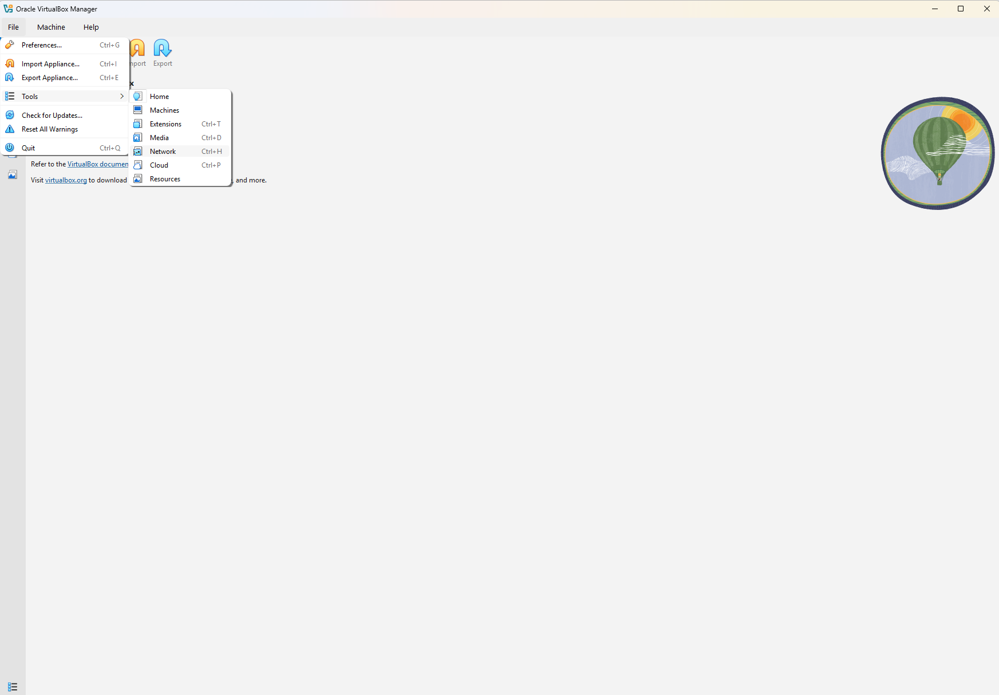
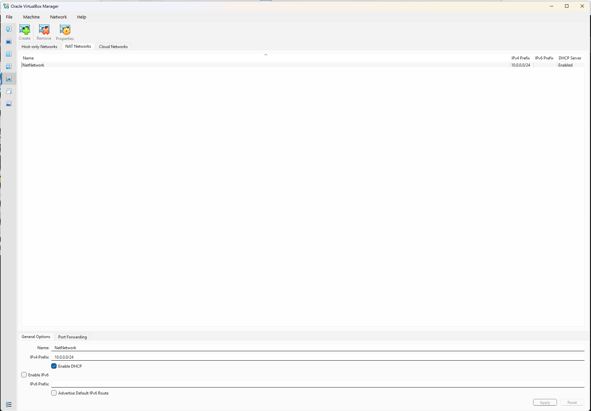
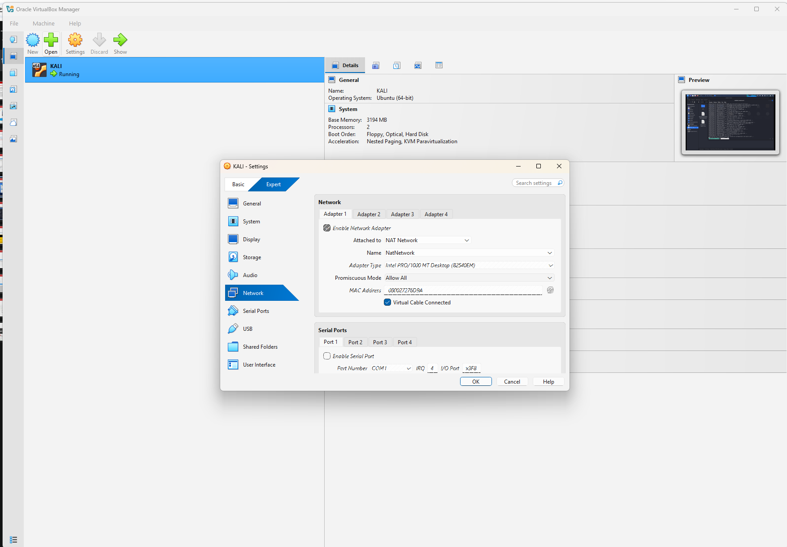
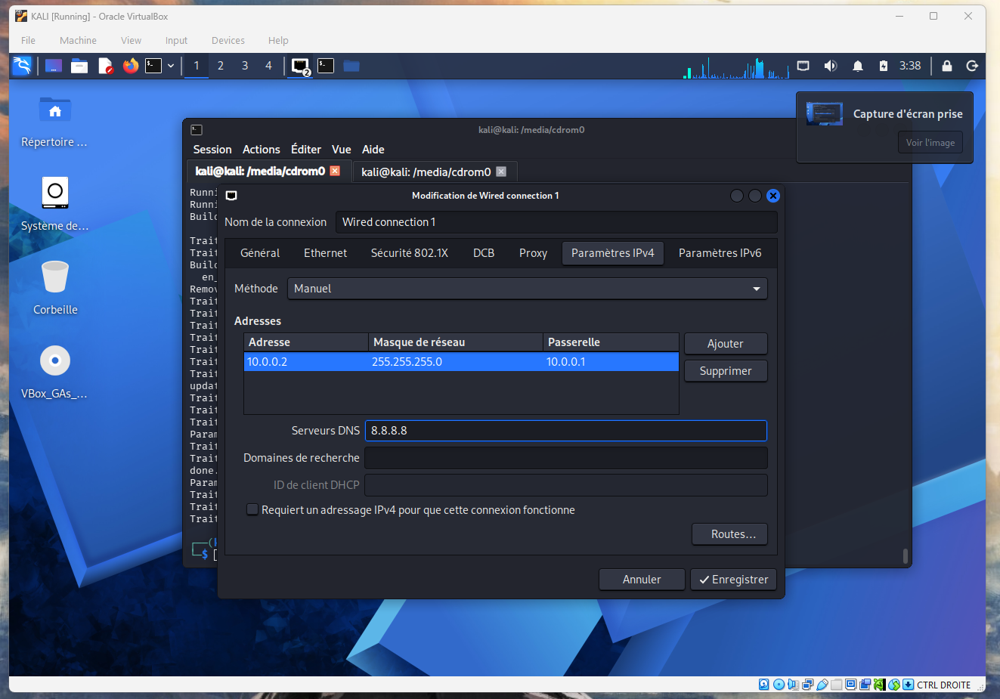
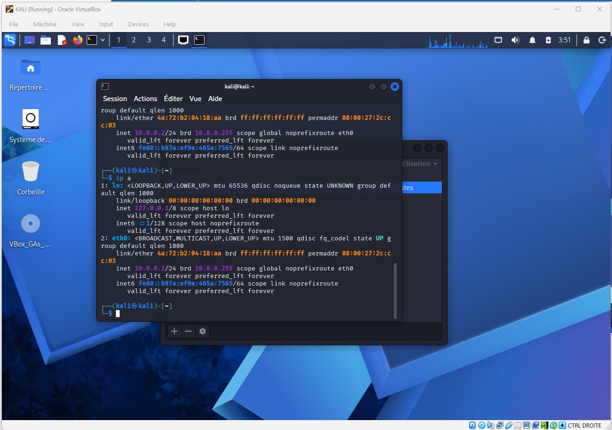

# Cybersecurity Lab Setup - VirtualBox + Kali Linux

NetworkWalks Internship, Batch B082 - Week 1, Project PM1

## What this is

Setting up a Kali Linux VM in VirtualBox and configuring the lab network so I can
add more machines to it in the coming weeks.

Installing the OS is straightforward, so most of this is about the network side.
That is where the choices actually matter.

## Setup

Host is Windows. Installed VirtualBox and the Extension Pack from virtualbox.org,
then downloaded the Kali installer ISO from kali.org.

Before installing I checked the ISO hash in PowerShell:

```powershell
Get-FileHash -Algorithm SHA256 .\kali-linux-installer-amd64.iso
```

and compared it against the SHA256 published on the Kali site. Takes a few seconds
and confirms the download was not corrupted or tampered with.

VM settings:

| Setting | Value |
|---|---|
| Name | KALI |
| Type | Linux - Debian (64-bit) |
| Base memory | 3194 MB |
| Processors | 2 |
| Acceleration | Nested Paging, KVM Paravirtualization |
| Disk | VDI, dynamically allocated |

The OS type is Debian, not Ubuntu. Kali is built on Debian and VirtualBox uses
this setting to pick the default hardware profile.

## Choosing the network mode

VirtualBox has several networking modes and they are not interchangeable:

| | Internet | VM to VM | Hidden from my home LAN |
|---|:--:|:--:|:--:|
| NAT | yes | no | yes |
| NAT Network | yes | yes | yes |
| Bridged | yes | yes | no |
| Host-Only | no | yes | yes |
| Internal | no | yes | yes |

I went with **NAT Network**.

Plain NAT works for internet access, but each VM gets its own private NAT engine,
so two VMs cannot reach each other. Since I will be adding a target machine later,
that would have been a problem.

Bridged was the one to avoid. It puts the VM straight onto my home network, so
anything I run in Kali is pointed at my router and the other devices in the house.
Not what I want from a machine I am using to practise scanning.

Host-Only and Internal have no internet access, so no `apt update`.

NAT Network is the only one that gives internet access, lets the VMs see each
other, and keeps them off my real network.

```
Internet
   |
Home router
   |
Windows host  (VirtualBox)
   |
NatNetwork   10.0.0.0/24   gateway 10.0.0.1
   |
KALI VM   10.0.0.2        [+ target VM later]
```

## Creating the NAT Network

File > Tools > Network



On the NAT Networks tab, Create, then:

| Field | Value |
|---|---|
| Name | NatNetwork |
| IPv4 Prefix | 10.0.0.0/24 |
| Enable DHCP | checked |
| Enable IPv6 | unchecked |



`10.0.0.0/24` is the network address, not an address any machine gets. The /24
gives a usable range of 10.0.0.1 to 10.0.0.254, with the gateway on 10.0.0.1.

Left IPv6 off to keep things simple for now.

## Attaching the VM

KALI > Settings > Network > Adapter 1

| Field | Value |
|---|---|
| Attached to | NAT Network |
| Name | NatNetwork |
| Adapter Type | Intel PRO/1000 MT Desktop (82540EM) |
| Promiscuous Mode | Allow All |
| Cable Connected | checked |



Promiscuous mode set to Allow All means the interface keeps frames that are not
addressed to its own MAC instead of dropping them. I need that later for packet
capture with Wireshark or tcpdump. On a production network this setting would be a
bad sign, but in an isolated lab it is what makes traffic analysis possible.

The Intel PRO/1000 MT adapter is supported by the Linux kernel out of the box, so
no extra drivers needed in the guest.

## Static IP inside Kali

DHCP is enabled on the NAT Network, but I gave the VM a fixed address instead so it
does not move between reboots. Once I start adding a second machine and running
scans, I want to know the address without checking every time.

In Kali: Settings > Advanced Network Configuration > Wired connection 1 > IPv4

| Field | Value |
|---|---|
| Method | Manual |
| Address | 10.0.0.2 |
| Netmask | 255.255.255.0 |
| Gateway | 10.0.0.1 |
| DNS | 8.8.8.8 |



The gateway has to be 10.0.0.1, which is the address VirtualBox gives the NAT
Network's virtual router. Any other value and traffic has nowhere to go.

## Checking it worked

```
ip a
```



`eth0` is UP with `inet 10.0.0.2/24`, which is what was configured. The
`noprefixroute` flag on the address confirms it came from a manual configuration
rather than DHCP.

One thing I noticed here: the MAC shown on `link/ether` is not the same as the one
under `permaddr`. The permanent address is the 08:00:27 one VirtualBox assigned
(that prefix belongs to Oracle), and the other is a randomised MAC that
NetworkManager generates by default.

Ping tests still to be added.

## Problems I ran into

**Started with plain NAT.** Internet worked fine, but reading about it I realised
every VM ends up on its own isolated NAT with the same address, so they cannot see
each other. Switched to a NAT Network.

**Picked Ubuntu as the OS type when creating the VM.** Kali is not in the dropdown
and I assumed Ubuntu was close enough. It is Debian-based. Changed it in
Settings > General with the VM powered off.

**VT-x errors.** If VirtualBox refuses to start a 64-bit guest, virtualisation is
either disabled in the BIOS/UEFI or Hyper-V is holding it. Enable Intel VT-x (or
AMD-V) in UEFI, and on Windows turn off Hyper-V, Windows Hypervisor Platform,
Virtual Machine Platform and Memory Integrity, then:

```powershell
bcdedit /set hypervisorlaunchtype off
```

**No IP inside the guest.** Before setting the static address, check Cable
Connected is ticked on Adapter 1. If using DHCP, also check it is enabled on the
NAT Network, then:

```bash
sudo dhclient -r eth0 && sudo dhclient eth0
```

## To do

- Add ping and `apt update` results.
- Check the DHCP pool range on the NAT Network. 10.0.0.2 is a static address, so I
  need to make sure it sits outside the range the DHCP server leases from, or a
  second VM could eventually be handed the same address.
- Take a snapshot of the clean VM so I can roll back after breaking things.

## What I took from this

The networking mode is a design decision, not just a setting. NAT and NAT Network
sound like the same thing, and the difference decides whether a multi-VM lab is
possible at all.

NAT is also isolation, and that is worth seeing as a security property. My Kali VM
has no presence on my home network. I knew the theory from CCNA, but this is the
first time I set it up deliberately as a boundary.

Static addressing is worth the extra two minutes in a lab. Knowing the machine is
always on 10.0.0.2 removes a step from everything that comes after.

## A note on use

Everything here is on my own hardware in a virtual network I built. Kali's tools
can do real damage, and using them against systems you do not own or have written
permission to test is illegal. Keep it in the lab.

## Author

Ghazi Smach

