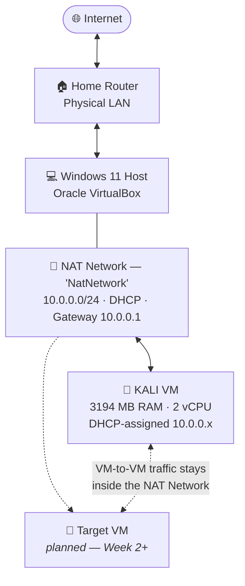

<div align="center">

# 🔐 Cybersecurity Lab Setup — VirtualBox + Kali Linux

### Building an isolated, internet-capable penetration testing lab on a Windows host

**NetworkWalks Internship — Batch B082 · Week 1 · Project PM1**


</div>

---

## 📋 Table of Contents

- [Project Overview](#-project-overview)
- [Objectives](#-objectives)
- [Why This Lab Matters](#-why-this-lab-matters)
- [Lab Architecture](#-lab-architecture)
- [Lab Specification](#-lab-specification)
- [Step 1 — VirtualBox and the Kali VM](#step-1--virtualbox-and-the-kali-vm)
- [Step 2 — Choosing a Networking Mode](#step-2--choosing-a-networking-mode)
- [Step 3 — Creating the NAT Network](#step-3--creating-the-nat-network)
- [Step 4 — Attaching the VM to the Network](#step-4--attaching-the-vm-to-the-network)
- [Problems Encountered & Solutions](#-problems-encountered--solutions)
- [What I Learned](#-what-i-learned)
- [Ethical Use](#️-ethical-use)
- [Tools & References](#-tools--references)
- [Author](#-author)

---

## 🎯 Project Overview

This repository documents the build of my personal cybersecurity lab: a Kali Linux
virtual machine running under Oracle VirtualBox on a Windows host, connected through
a purpose-built **NAT Network** on the `10.0.0.0/24` range.

The goal was not simply to get Kali booting. It was to build a lab that is
**isolated from my home network**, **reachable between virtual machines**, and
**able to reach the internet for updates** — the three properties every offensive
security lab needs before any tooling work begins.

The write-up therefore focuses on the **network design**, which is where the real
decisions are. Installing an operating system from an ISO is a well-documented,
click-through process; choosing the wrong VirtualBox networking mode quietly breaks
the lab in ways that only become obvious weeks later.

This is Week 1 of the NetworkWalks B082 internship programme and forms the
foundation that all subsequent weekly projects are built on.

---

## 🎯 Objectives

- [x] Oracle VirtualBox installed and functional on the Windows host
- [x] Kali Linux installed from the official ISO into a dedicated virtual machine
- [x] A dedicated VirtualBox **NAT Network** created on `10.0.0.0/24` with DHCP enabled
- [x] The Kali VM attached to that NAT Network and receiving an address automatically
- [x] The host LAN protected: the VM has no presence on my physical network
- [x] The lab designed to accommodate a second VM in later weeks
- [ ] Connectivity test results documented — *to be added*

---

## 💡 Why This Lab Matters

A virtual lab is the only responsible place to practise offensive security. It gives me:

- **A legal target environment.** Scanning or exploiting systems I do not own is a
  crime. A lab I built myself removes that risk entirely.
- **Containment.** Aggressive scans, malware samples and misconfigurations stay
  inside the virtual network instead of reaching my router or anyone else's traffic.
- **Repeatability.** Snapshots mean I can destroy the environment, revert in seconds,
  and repeat an exercise until I understand it.
- **A realistic network.** Later weeks add a vulnerable target VM. Because this lab
  is built on a NAT Network rather than plain NAT, those VMs will be able to see and
  attack each other — which plain NAT would not allow.

> ⚠️ Everything in this repository is for education inside an environment I own.
> See [Ethical Use](#️-ethical-use).

---

## 🗺️ Lab Architecture



**How traffic flows.** The Kali VM sends packets to the virtual gateway at `10.0.0.1`.
VirtualBox's NAT engine translates them to the host's IP address and forwards them to
the physical router. Return traffic is translated back. From my home router's point of
view only one device exists — the host. The Kali VM has no presence on the physical
LAN at all, which is exactly the isolation I wanted.

Critically, because this is a **NAT Network** and not plain **NAT**, all VMs attached
to `NatNetwork` share one virtual switch and can address each other directly on
`10.0.0.0/24`. That is what makes Week 2's attacker-vs-target exercises possible.

---

## ⚙️ Lab Specification

### Virtual machine

| | Setting | Value | Reasoning |
|:--:|---|---|---|
| 🏷️ | VM name | `KALI` | — |
| 🐧 | OS type | Debian (64-bit) | Kali is Debian-based, not Ubuntu-based |
| 🧠 | Base memory | 3194 MB | Comfortable for the Xfce desktop plus heavier tools |
| ⚡ | Processors | 2 vCPU | Enough for parallel scanning without starving the host |
| 🚀 | Acceleration | Nested Paging, KVM Paravirtualization | Hardware-assisted memory management; large performance gain |
| 💾 | Virtual disk | VDI, dynamically allocated | Grows on demand instead of claiming full size up front |

### Network

| | Setting | Value |
|:--:|---|---|
| 🔀 | Network mode | NAT Network |
| 🏷️ | Network name | `NatNetwork` |
| 🌐 | IPv4 prefix | `10.0.0.0/24` |
| 📡 | DHCP server | Enabled |
| 🚫 | IPv6 | Disabled — keeps the lab single-stack and easier to reason about |
| 🔌 | Adapter 1 attached to | NAT Network → `NatNetwork` |
| 🎛️ | Adapter type | Intel PRO/1000 MT Desktop (82540EM) |
| 👁️ | Promiscuous mode | Allow All |
| 🔗 | Cable connected | Yes |

---

## Step 1 — VirtualBox and the Kali VM

Oracle VirtualBox is the type-2 hypervisor hosting the lab — it runs as an
application on top of Windows rather than on bare metal, which is the right
trade-off for a portable learning environment.

1. Install **VirtualBox** (Windows hosts) from the
   [official downloads page](https://www.virtualbox.org/wiki/Downloads), plus the
   **Extension Pack**.
2. Download the **Kali Linux Installer ISO (64-bit)** from
   [kali.org/get-kali](https://www.kali.org/get-kali/).
3. **Verify the ISO checksum before installing it.** In PowerShell:

   ```powershell
   Get-FileHash -Algorithm SHA256 .\kali-linux-2025.x-installer-amd64.iso
   ```

   Compare against the `SHA256SUMS` value published by Kali. If it does not match,
   delete the file and download again. This takes fifteen seconds and is the
   difference between installing Kali and installing whatever a compromised mirror
   served.

4. Create the VM (**Machine → New**) with the specification in the table above, then
   run the graphical installer. A standard, non-root user account with `sudo` is the
   correct habit — modern Kali no longer logs in as root by default.

> 🔧 **Prerequisite:** hardware virtualisation (Intel VT-x / AMD-V) must be enabled in
> the BIOS/UEFI. Without it VirtualBox cannot run 64-bit guests.
> See [Problems Encountered](#-problems-encountered--solutions).

> ⚠️ Set the OS version to **Debian (64-bit)**, not Ubuntu. Kali is built on Debian,
> and the OS type determines which default hardware profile VirtualBox applies.

---

## Step 2 — Choosing a Networking Mode

This is the heart of the project. VirtualBox offers five ways to attach a virtual
network adapter, and they are not interchangeable.

| Requirement | NAT | NAT Network | Bridged | Host-Only | Internal |
|---|:--:|:--:|:--:|:--:|:--:|
| VM reaches the internet | ✅ | ✅ | ✅ | ❌ | ❌ |
| VM-to-VM communication | ❌ | ✅ | ✅ | ✅ | ✅ |
| VM hidden from physical LAN | ✅ | ✅ | ❌ | ✅ | ✅ |
| Host can reach VM directly | ⚠️ port-fwd | ⚠️ port-fwd | ✅ | ✅ | ❌ |

**NAT Network is the only mode that delivers internet access, VM-to-VM traffic, and
isolation from the home LAN at the same time.**

Why the others were rejected:

- **Plain NAT** gives each VM its own private NAT engine. Two VMs both receive
  `10.0.2.15` and have no path to each other — they are in isolated tunnels, not on a
  shared network. That makes next week's attacker/target exercise impossible.
- **Bridged** puts the VM directly on my physical home network. An `nmap` sweep from a
  bridged Kali box would hit the router, family devices and printers. On a shared or
  university network that can violate acceptable-use policy and is indistinguishable
  from an attack.
- **Host-Only** has no internet access at all, so `apt update` fails. Useful as a
  *second* adapter later, not as the only one.
- **Internal** is a true air gap — no host, no internet. Correct for detonating live
  malware, too restrictive for a general-purpose lab.

> 💡 **The deciding question** for any lab is not "which mode gives internet access"
> — three of them do. It is "which mode gives internet access *and* lets my VMs talk
> to each other *without* exposing them to my real network." Only NAT Network answers
> all three.

---

## Step 3 — Creating the NAT Network

### 3.1 — Open the Network manager

**File → Tools → Network**


### 3.2 — Create the network

On the **NAT Networks** tab, click **Create**, then configure:

| Field | Value |
|---|---|
| Name | `NatNetwork` |
| IPv4 Prefix | `10.0.0.0/24` |
| Enable DHCP | ✅ Checked |
| Enable IPv6 | ❌ Unchecked |


The network is now registered with IPv4 prefix `10.0.0.0/24` and its DHCP server
enabled, ready for VMs to attach to it.

> 🔍 **On `10.0.0.0/24`.** This is a *network address*, not a host address. The `/24`
> prefix defines a usable range of `10.0.0.1`–`10.0.0.254`: `10.0.0.1` is taken by the
> virtual gateway, and the built-in DHCP server leases the rest to attached VMs. No
> machine is ever assigned `10.0.0.0` itself.

---

## Step 4 — Attaching the VM to the Network

Select the **KALI** VM → **Settings → Network → Adapter 1**:

| Field | Value | Why |
|---|---|---|
| Enable Network Adapter | ✅ | — |
| Attached to | **NAT Network** | The mode chosen in Step 2 |
| Name | `NatNetwork` | The network created in Step 3 |
| Adapter Type | Intel PRO/1000 MT Desktop (82540EM) | Natively supported by the Linux kernel — no extra drivers needed |
| Promiscuous Mode | **Allow All** | Lets the NIC see frames not addressed to it — required for packet capture in later weeks |
| Cable Connected | ✅ | A virtual unplugged cable is a classic cause of "no network" |


> 🔍 **On promiscuous mode.** By default a network interface discards Ethernet frames
> whose destination MAC is not its own. **Allow All** disables that filter, so tools
> like Wireshark and `tcpdump` can observe traffic between other machines on the
> virtual switch — essential for the traffic-analysis and ARP exercises that follow.
> In production this setting would be a red flag: it is precisely what an attacker
> enables after compromising a host in order to harvest credentials from the wire.
> Here it is a deliberate, documented choice appropriate to an isolated lab.

---

## 🛠️ Problems Encountered & Solutions

Recorded as **cause → fix**, because that is the order you meet them in.

### 1. Plain NAT gave internet but no VM-to-VM path

**Cause.** Plain NAT gives each VM its own isolated NAT engine; VMs cannot see each
other and all receive the same address.
**Fix.** Created a shared **NAT Network** on `10.0.0.0/24` instead.

### 2. VM created with the wrong OS type

**Cause.** Kali is absent from the version dropdown, and Kali is Debian-based rather
than Ubuntu-based. The OS type drives VirtualBox's default hardware profile.
**Fix.** Powered off the VM → Settings → General → Version → **Debian (64-bit)**.

### 3. 64-bit guest option missing / `VT-x is not available`

**Cause.** Hardware virtualisation disabled in UEFI, or Windows Hyper-V holding the
virtualisation extensions.
**Fix.** Enable Intel VT-x / AMD-V in UEFI; disable Hyper-V, Windows Hypervisor
Platform, Virtual Machine Platform and Memory Integrity, then:

```powershell
bcdedit /set hypervisorlaunchtype off
```

### 4. No IP address inside the guest

**Cause.** "Cable Connected" unchecked, or DHCP not enabled on the NAT Network.
**Fix.** Verify both in the GUI, then force a lease renewal:

```bash
sudo dhclient -r eth0 && sudo dhclient eth0
```

---

## 🎓 What I Learned

**1. Networking mode is an architectural decision, not a checkbox.**
The difference between NAT and NAT Network looks like a naming detail and turns out to
determine whether a multi-VM lab is possible at all. Reading what each mode actually
does — rather than picking whichever gives internet access — is what made the lab work
for Week 2 as well as Week 1.

**2. NAT is a form of isolation, and that is a security property.**
My Kali VM has no presence on the physical LAN. Nothing on my home network can reach
it, and nothing it does reaches my home network unsolicited. This is the same
one-way-visibility principle that makes NAT a de facto perimeter control on home
routers — I understood it in theory from my CCNA studies, and this is the first time I
have configured it as a deliberate containment boundary.

**3. Understanding CIDR prevents a common confusion.**
`10.0.0.0/24` is a network address describing a range, not an address any machine
holds. The `/24` prefix is what tells the DHCP server which addresses it may lease.

**4. Layered testing beats guessing.**
Separating "can I reach an IP address" from "can I resolve a name" turns
troubleshooting from trial and error into a decision tree. Each test eliminates one
layer of the stack.

**5. Verify before you trust.**
Checking the ISO's SHA256 hash costs seconds. Building the habit on a low-stakes
download is how it becomes automatic on a high-stakes one.

---

## ⚖️ Ethical Use

Everything documented here was performed on hardware I own, inside a virtual network I
created, isolated from any production or third-party system.

Kali Linux contains tools capable of causing real harm. Using them against systems you
do not own or lack **explicit written authorisation** to test is illegal in most
jurisdictions, including Tunisia, the EU and the United States. This repository is
published for educational purposes as part of a supervised internship programme.
**Practise only in your own lab.**

---

## 🧰 Tools & References

- [Oracle VirtualBox](https://www.virtualbox.org/) — type-2 hypervisor
- [VirtualBox Networking Manual](https://www.virtualbox.org/manual/ch06.html) — authoritative reference on the networking modes
- [Kali Linux](https://www.kali.org/) — Debian-based security distribution
- [Kali Documentation](https://www.kali.org/docs/) — installation guides
- [NetworkWalks](https://networkwalks.com/) — internship programme

---

## 👤 Author

**Ghazi**
Final-year Cybersecurity Engineering Student — EPI Digital School, Sousse, Tunisia
Cisco CCNA · Fortinet NSE · Microsoft Azure Fundamentals

- GitHub: [@ghazi23-dev](https://github.com/ghazi23-dev)
- LinkedIn: *add your profile URL here*

---

## 📌 Project Information

| | |
|---|---|
| **Programme** | NetworkWalks Cybersecurity Internship |
| **Batch** | B082 |
| **Week** | 1 |
| **Project** | PM1 — Cybersecurity Lab Setup |
| **Repository** | [NETWORKWALKS-B082-WK1-PM1-CYBERSECURITY-LAB-SETUP](https://github.com/ghazi23-dev/NETWORKWALKS-B082-WK1-PM1-CYBERSECURITY-LAB-SETUP) |
| **Completed** | September 2026 |

<div align="center">

⭐ *If this write-up helped you build your own lab, consider starring the repository.*

</div>
